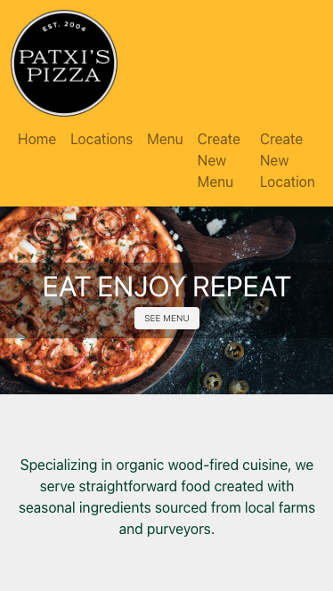
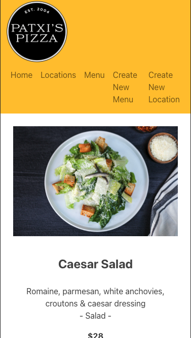
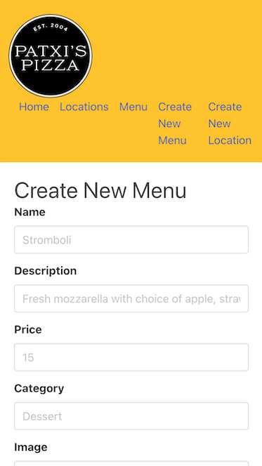

# [Patxi's Pizza | MERN-stack and Full CRUD](https://patxispizza.netlify.app)
This restaurant web application makes it easy for restaurant owner to create and update their restaurant profiles and menus to showcase delicious food and connect with customers.

## Screenshot
#### Landing Page

#### Menu Page

#### Create a New Menu Page

## Technologies Used
- MongoDB/Mongoose
- Express
- React
- Node
- Netlify

## Getting Started
For the backend repository of the Restaurant Web Application, click [HERE](https://github.com/Apple-supaporn/project-3-restaurant-app-backend)

To access the deployed version of our restaurant web application, simply click on the following link: [Restaurant Web Application](https://patxispizza.netlify.app)

Exploring the Features :-
Our restaurant web application allows you to perform the following actions:
- View the Menus and locations
- Browse Menu Categories
- Create a New Menu
- Create a New Location

Project Planning :-
If you're interested in learning more about the planning and development process of this application, you can check out our [Trello board](https://trello.com/b/EFES3mM3/restaurant-project-3)

## Next Steps
- Owner Authentication, this system ensures that only the owner can sign in and access or update their restaurant's information.
- Create a gallery page to display pictures of restaurant's food and ambiance.
- Improve the website design to make it more enjoyable for users.

Your contributions and ideas are always welcome!
