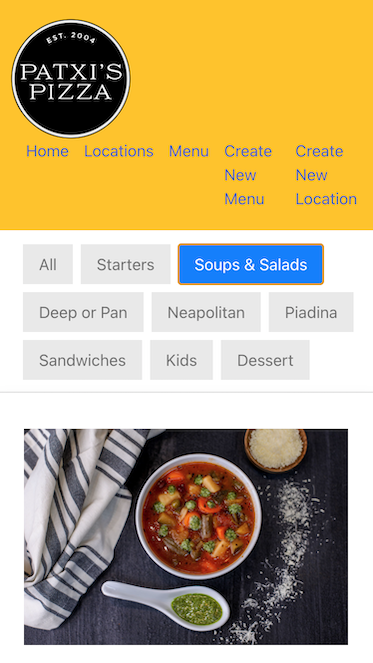

# [Restaurant app | MERN-stack and Full CRUD](https://651261237a23ae0008a84474--rainbow-hotteok-68b1d6.netlify.app/home)
This restaurant web application makes it easy for restaurant owner to create and update their restaurant profiles and menus to showcase delicious food and connect with customers.

## Screenshot

## Technologies Used
- MongoDB/Mongoose
- Express
- React
- Node

## Getting Started
To access the deployed version of our restaurant web application, simply click on the following link: [Restaurant Web Application](https://651261237a23ae0008a84474--rainbow-hotteok-68b1d6.netlify.app/home)

Exploring the Features :-
Our restaurant web application allows you to perform the following actions:
- View the Menus
- Create a New Menu
- Create a New Location

Project Planning :-
If you're interested in learning more about the planning and development process of this application, you can check out our [Trello board](https://trello.com/b/EFES3mM3/restaurant-project-3)

## Next Steps
- Owner Authentication, this system ensures that only the owner can sign in and access or update their restaurant's information.
- Create a gallery page to display pictures of restaurant's food and ambiance.
- Improve the website design to make it more enjoyable for users.

Your contributions and ideas are always welcome!
